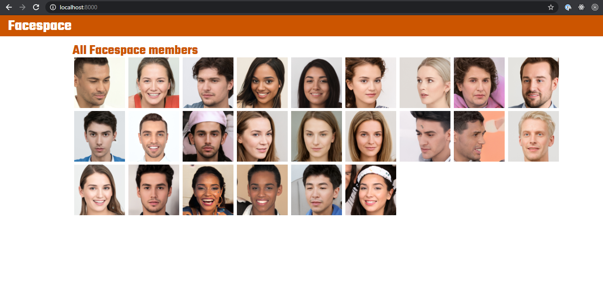
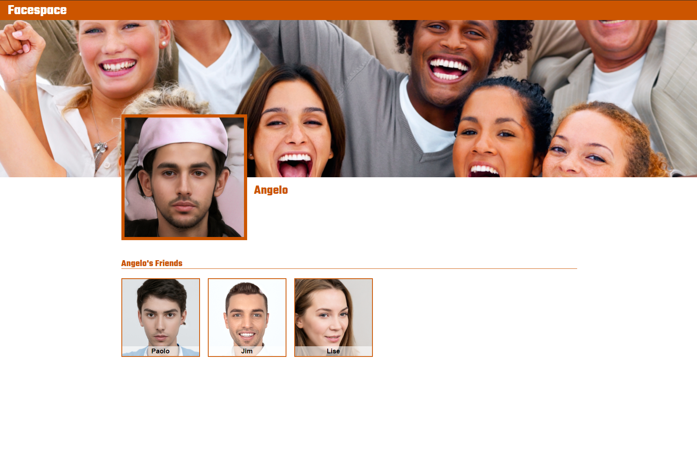
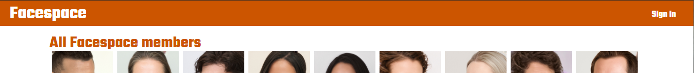
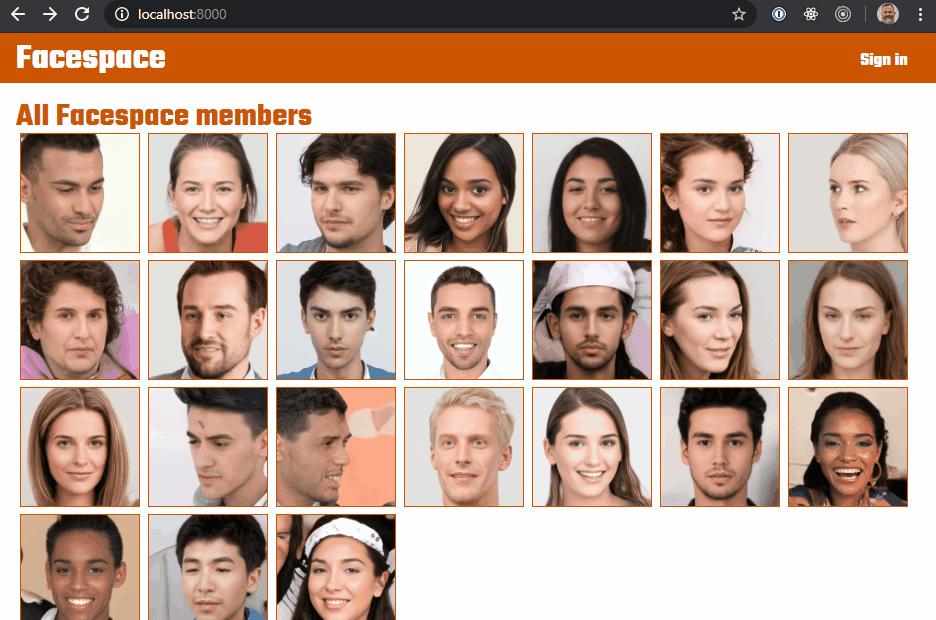
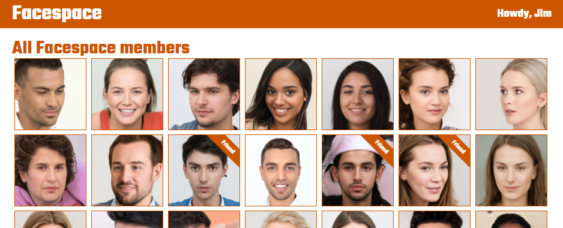

# Mini-Project: Facespace!

## FaceSpace

A small project to focus the familiarity of social media profile interactions done by Rakin Bhuiyan.

## Screenshots

### Homepage

### The Profile Page

### The Sign in page

### A link to the signin page in the header

When the user is signed in, the "sign in" link should be replaced by a greeting and the user's name.

### Faces on the homepage

### My Friends!

When a user is signed in, he will be able to identify his/her friends from all the users.

